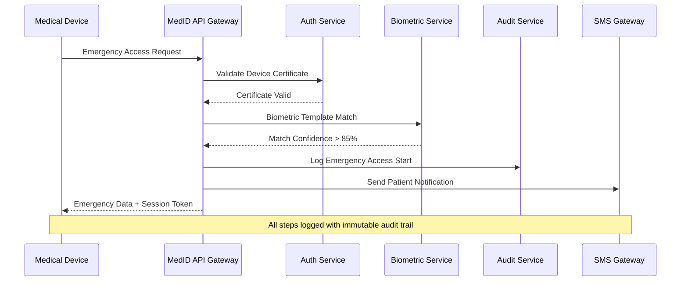

# MedID Security Architecture

## Executive Summary
MedID implements a defense-in-depth security architecture designed to protect biometric health data while enabling life-saving emergency access. The system employs zero-trust principles, end-to-end encryption, and comprehensive audit logging to ensure HIPAA, GDPR, and Aadhaar compliance.

## Security Principles

### 1. Zero Trust Architecture
- No implicit trust based on network location
- Every request authenticated and authorized
- Continuous verification of user and device identity
- Least privilege access controls

### 2. Defense in Depth
- Multiple layers of security controls
- Network, application, and data-level protection
- Redundant security measures
- Fail-secure design principles

### 3. Privacy by Design
- Data minimization from collection to storage
- Purpose limitation for data processing
- Encryption as the default state
- User consent and control mechanisms

### 4. Security Transparency
- Comprehensive audit logging
- Real-time security monitoring
- Regular security assessments
- Open security documentation

## Threat Model

### Primary Threats

#### T1: Unauthorized Biometric Access
**Description**: Attackers attempting to access biometric templates for identity theft or surveillance.

**Mitigations**:
- Biometric templates encrypted with AES-256-GCM
- Templates stored as one-way embeddings, not raw images
- HMAC-based indexing prevents rainbow table attacks
- Template access requires multiple authentication factors
- HSM-protected template encryption keys

#### T2: Break-Glass Abuse
**Description**: Misuse of emergency access capabilities for unauthorized data retrieval.

**Mitigations**:
- All break-glass access requires documented medical emergency
- Biometric verification mandatory for emergency access
- Real-time patient notification within 15 minutes
- Immutable audit trail with hash chain verification
- Post-facto review of all emergency access events
- Automatic flagging of suspicious access patterns

#### T3: Device Compromise
**Description**: Compromised medical devices used for unauthorized system access.

**Mitigations**:
- Device authentication via X.509 certificates
- Certificate-based mutual TLS for all communications
- Device attestation and health monitoring
- Geofencing and location-based access controls
- Automatic device isolation upon compromise detection
- Certificate revocation and blacklisting capabilities

#### T4: Insider Threats
**Description**: Authorized users misusing their access privileges.

**Mitigations**:
- Role-based access control with minimal necessary permissions
- Segregation of duties for sensitive operations
- Comprehensive user activity monitoring
- Behavioral anomaly detection
- Regular access review and certification
- Background checks for privileged users

#### T5: Data Exfiltration
**Description**: Large-scale theft of patient health information.

**Mitigations**:
- Field-level encryption prevents bulk data exposure
- Data loss prevention (DLP) monitoring
- Network segmentation and micro-perimeters
- Encrypted database connections and storage
- API rate limiting and anomaly detection
- Zero-trust network architecture

#### T6: Man-in-the-Middle Attacks
**Description**: Interception and manipulation of data in transit.

**Mitigations**:
- TLS 1.3 with perfect forward secrecy
- Certificate pinning for mobile applications
- HSTS headers and security policies
- End-to-end message authentication
- Encrypted payload verification

## Authentication Architecture

### Multi-Factor Authentication Framework

#### Layer 1: Device Authentication
```
Device Certificate (X.509) + Device Attestation + Location Verification
```

**Implementation**:
- Each medical device issued unique X.509 certificate
- Certificate includes device capabilities and restrictions
- Device health attestation via TPM or secure enclave
- GPS/network-based location verification
- Certificate rotation every 90 days

**Certificate Structure**:
```
Subject: CN=MedID-Device-001, OU=Emergency-Dept, O=City-Hospital
Extensions:
  - Device-Type: mobile_scanner
  - Capabilities: facial_recognition,nfc_reader
  - Max-Emergency-Sessions: 10
  - Geographic-Restriction: 40.7128,-74.0060,1000m
```

#### Layer 2: User Authentication
```
Username/Password + TOTP/SMS + Biometric (Optional)
```

**Implementation**:
- Enterprise SSO integration (SAML/OIDC)
- Time-based OTP via authenticator app
- SMS backup for emergency situations
- Optional biometric authentication for high-privilege operations
- Session timeout and concurrent session limits

#### Layer 3: API Authentication
```
JWT Token + Request Signing + Rate Limiting
```

**Implementation**:
- Short-lived JWT tokens (15-minute expiry)
- Refresh token mechanism with revocation
- HMAC-SHA256 request signing for critical operations
- Per-endpoint rate limiting and throttling
- Token binding to device certificates

### Break-Glass Authentication Flow



## Encryption Architecture

### Envelope Encryption Strategy

#### Data Encryption Keys (DEKs)
- **Purpose**: Encrypt individual data records
- **Algorithm**: AES-256-GCM with 96-bit IV
- **Scope**: Per-patient or per-record encryption
- **Rotation**: Automatic rotation every 30 days
- **Storage**: Encrypted with KEKs, stored in database

#### Key Encryption Keys (KEKs)
- **Purpose**: Encrypt Data Encryption Keys
- **Algorithm**: AES-256-GCM or RSA-4096
- **Scope**: Service or tenant-level encryption
- **Rotation**: Quarterly rotation schedule
- **Storage**: Hardware Security Module (HSM)

#### Master Keys
- **Purpose**: Encrypt Key Encryption Keys
- **Algorithm**: AES-256 with hardware RNG
- **Scope**: System-wide master encryption
- **Rotation**: Annual rotation with multi-party control
- **Storage**: FIPS 140-2 Level 3 HSM

### Field-Level Encryption Implementation

#### Patient Data Encryption
```python
def encrypt_patient_field(data, field_type, patient_id):
    # Generate unique DEK for this field
    dek = generate_dek()
    
    # Encrypt data with DEK
    iv = os.urandom(12)  # 96-bit IV for GCM
    cipher = AES.new(dek, AES.MODE_GCM, nonce=iv)
    ciphertext, auth_tag = cipher.encrypt_and_digest(data.encode())
    
    # Encrypt DEK with KEK
    kek = get_kek_for_patient(patient_id)
    encrypted_dek = encrypt_with_kek(dek, kek)
    
    # Store encrypted data with metadata
    return {
        'encrypted_data': base64.b64encode(ciphertext + auth_tag),
        'encrypted_key': base64.b64encode(encrypted_dek),
        'iv': base64.b64encode(iv),
        'algorithm': 'AES-256-GCM',
        'key_version': get_current_key_version()
    }
```

#### Biometric Template Encryption
```python
def encrypt_biometric_template(embedding_vector, patient_id):
    # Quantize and serialize embedding
    quantized = quantize_embedding(embedding_vector)
    serialized = serialize_embedding(quantized)
    
    # Generate unique salt and compute HMAC
    salt = os.urandom(32)
    hmac_key = derive_hmac_key(patient_id, salt)
    template_hash = hmac.new(hmac_key, serialized, hashlib.sha256).hexdigest()
    
    # Encrypt serialized template
    encrypted_template = encrypt_patient_field(
        serialized, 
        'biometric_template', 
        patient_id
    )
    
    return {
        'template_hash': template_hash,
        'template_encrypted': encrypted_template,
        'salt': base64.b64encode(salt),
        'algorithm': 'face_recognition_v1'
    }
```

### Key Management Service Integration

#### HashiCorp Vault Configuration
```hcl
# Enable transit secrets engine for encryption
path "transit/encrypt/medid-patient-data" {
  capabilities = ["update"]
}

path "transit/decrypt/medid-patient-data" {
  capabilities = ["update"]
}

# Database dynamic secrets
path "database/creds/medid-app" {
  capabilities = ["read"]
}

# PKI for device certificates
path "pki/issue/medid-devices" {
  capabilities = ["update"]
}
```

#### Key Rotation Policy
```json
{
  "key_rotation_policy": {
    "master_keys": {
      "rotation_interval": "365d",
      "advance_notice": "30d",
      "multi_party_approval": true
    },
    "kek_keys": {
      "rotation_interval": "90d",
      "automatic_rotation": true,
      "version_retention": 3
    },
    "dek_keys": {
      "rotation_interval": "30d",
      "lazy_rotation": true,
      "version_retention": 2
    },
    "device_certificates": {
      "rotation_interval": "90d",
      "auto_renewal": true,
      "overlap_period": "7d"
    }
  }
}
```

## Access Control Architecture

### Role-Based Access Control (RBAC)

#### Predefined Roles

##### emergency_responder
```yaml
permissions:
  - emergency:match:read
  - emergency:data:read
  - emergency:session:create
  - audit:emergency:create
restrictions:
  - max_sessions_per_hour: 10
  - geographic_restriction: true
  - require_break_glass_reason: true
  - patient_notification_required: true
```

##### doctor
```yaml
permissions:
  - patient:read
  - patient:update
  - records:read
  - records:write
  - emergency:data:read
  - consent:read
restrictions:
  - max_patients_per_day: 50
  - require_patient_consent: true
  - audit_all_access: true
```

##### nurse
```yaml
permissions:
  - patient:read:basic
  - records:read:basic
  - vital_signs:write
restrictions:
  - max_patients_per_shift: 20
  - require_doctor_supervision: true
  - limited_emergency_access: true
```

##### lab_technician
```yaml
permissions:
  - patient:read:identifier
  - lab_results:write
  - lab_orders:read
restrictions:
  - lab_data_only: true
  - no_emergency_access: true
```

##### auditor
```yaml
permissions:
  - audit:read
  - compliance:read
  - reports:generate
restrictions:
  - read_only_access: true
  - no_patient_data: true
  - ip_whitelist_required: true
```

##### system_admin
```yaml
permissions:
  - system:configure
  - users:manage
  - devices:manage
  - keys:rotate
restrictions:
  - multi_factor_required: true
  - session_recording: true
  - approval_required: true
```

### Attribute-Based Access Control (ABAC)

#### Emergency Access Policy
```json
{
  "policy_id": "emergency_access_v1",
  "description": "Break-glass emergency access authorization",
  "rules": [
    {
      "condition": "AND",
      "criteria": [
        {
          "subject.role": "IN ['emergency_responder', 'doctor']"
        },
        {
          "device.certified": "== true"
        },
        {
          "device.location": "WITHIN patient.hospital_network"
        },
        {
          "biometric.confidence": ">= 0.85"
        },
        {
          "emergency.type": "IN emergency_types.critical"
        },
        {
          "time.hour": "BETWEEN 0 AND 23"
        }
      ]
    }
  ],
  "actions": {
    "allow": [
      "patient.emergency_summary:read",
      "patient.allergies:read",
      "patient.blood_group:read",
      "patient.medications:read",
      "patient.emergency_contacts:read"
    ],
    "audit": [
      "log_emergency_access",
      "notify_patient",
      "alert_security_team"
    ]
  }
}
```

## Network Security Architecture

### Zero Trust Network Model

#### Network Segmentation
```
Internet
  ↓
WAF/DDoS Protection
  ↓
API Gateway (DMZ)
  ↓
Application Network (Private)
  ↓
Database Network (Isolated)
  ↓
HSM Network (Air-gapped)
```

#### Micro-Segmentation Rules
```yaml
network_policies:
  api_gateway:
    ingress:
      - from: internet
        ports: [443]
        protocol: HTTPS
    egress:
      - to: auth_service
        ports: [8080]
      - to: patient_service
        ports: [8081]
      
  biometric_service:
    ingress:
      - from: api_gateway
        ports: [8082]
        protocol: mTLS
    egress:
      - to: hsm_network
        ports: [9000]
        protocol: PKCS#11
    isolation: high_security
    
  database:
    ingress:
      - from: application_services
        ports: [5432]
        protocol: TLS
    egress: []
    encryption: required
```

### TLS Configuration

#### TLS 1.3 Implementation
```nginx
# Nginx TLS configuration
ssl_protocols TLSv1.3;
ssl_ciphers 'TLS_AES_256_GCM_SHA384:TLS_CHACHA20_POLY1305_SHA256';
ssl_prefer_server_ciphers on;
ssl_session_cache shared:SSL:10m;
ssl_session_timeout 1h;
ssl_stapling on;
ssl_stapling_verify on;

# Security headers
add_header Strict-Transport-Security "max-age=31536000; includeSubDomains; preload" always;
add_header X-Content-Type-Options "nosniff" always;
add_header X-Frame-Options "DENY" always;
add_header Content-Security-Policy "default-src 'self'; connect-src 'self' https://api.medid.example.com" always;
```

#### Certificate Management
```yaml
certificate_lifecycle:
  root_ca:
    validity: 10_years
    key_size: 4096
    storage: air_gapped_hsm
    
  intermediate_ca:
    validity: 5_years
    key_size: 4096
    storage: network_hsm
    
  device_certificates:
    validity: 90_days
    key_size: 2048
    auto_renewal: true
    revocation_check: mandatory
    
  server_certificates:
    validity: 365_days
    key_size: 2048
    auto_renewal: true
    transparency_logs: required
```

## Audit and Monitoring

### Comprehensive Audit Framework

#### Audit Event Categories
1. **Authentication Events**
   - Login attempts (success/failure)
   - Multi-factor authentication events
   - Device certificate validation
   - Session creation/termination

2. **Authorization Events**
   - Permission grants/denials
   - Role assignments/changes
   - Policy evaluations
   - Break-glass access approvals

3. **Data Access Events**
   - Patient record access
   - Health record modifications
   - Biometric template operations
   - Emergency data retrieval

4. **System Events**
   - Configuration changes
   - Key rotations
   - Certificate renewals
   - Service deployments

5. **Security Events**
   - Intrusion attempts
   - Anomalous behavior detection
   - Security policy violations
   - Incident response actions

#### Audit Log Structure
```json
{
  "event_id": "uuid",
  "timestamp": "2024-01-15T10:30:00.123Z",
  "event_type": "emergency_access",
  "event_category": "data_access",
  "severity": "high",
  "actor": {
    "type": "user",
    "id": "dr-smith-001",
    "role": "emergency_responder",
    "session_id": "session-uuid"
  },
  "device": {
    "id": "device-er-tablet-001",
    "certificate_fingerprint": "sha256:...",
    "location": {
      "latitude": 40.7128,
      "longitude": -74.0060,
      "accuracy": 10
    }
  },
  "resource": {
    "type": "patient",
    "id": "patient-uuid",
    "fields_accessed": ["allergies", "blood_group", "medications"]
  },
  "context": {
    "emergency_type": "unconscious",
    "break_glass_reason": "Patient unconscious, immediate allergy information needed",
    "biometric_confidence": 0.92,
    "session_duration": "PT15M"
  },
  "outcome": {
    "status": "success",
    "patient_notified": true,
    "notification_method": "sms",
    "data_returned": true
  },
  "compliance": {
    "frameworks": ["HIPAA", "GDPR"],
    "legal_basis": "vital_interests",
    "retention_until": "2031-01-15T10:30:00Z"
  },
  "integrity": {
    "previous_hash": "sha256:...",
    "current_hash": "sha256:...",
    "signature": "..."
  }
}
```

### Real-Time Monitoring

#### Security Metrics Dashboard
```yaml
monitoring_metrics:
  authentication:
    - failed_login_attempts_per_hour
    - device_certificate_validation_failures
    - multi_factor_authentication_bypass_attempts
    
  authorization:
    - break_glass_access_frequency
    - permission_escalation_attempts
    - policy_violation_counts
    
  data_access:
    - emergency_access_response_time
    - patient_record_access_volume
    - biometric_match_success_rate
    
  system_health:
    - encryption_operation_latency
    - key_rotation_success_rate
    - certificate_expiration_warnings
    
  threat_detection:
    - anomalous_access_patterns
    - geographic_access_violations
    - bulk_data_access_attempts
```

#### Automated Alerting
```yaml
alert_rules:
  critical:
    - multiple_failed_emergency_access_attempts:
        threshold: 3_per_hour
        action: lock_device
        
    - biometric_template_bulk_access:
        threshold: 100_per_minute
        action: immediate_investigation
        
    - geographic_anomaly:
        condition: device_location_change > 500km_per_hour
        action: revoke_certificate
        
  warning:
    - high_emergency_access_volume:
        threshold: 50_per_day_per_device
        action: security_review
        
    - certificate_expiration:
        threshold: 7_days_remaining
        action: auto_renewal
        
  info:
    - successful_key_rotation:
        action: log_completion
        
    - new_device_registration:
        action: notify_administrators
```

## Incident Response

### Security Incident Classification

#### Level 1: Critical
- Biometric data breach
- HSM compromise
- Break-glass abuse pattern
- System-wide outage

**Response Time**: 15 minutes
**Escalation**: CISO, Legal, External authorities

#### Level 2: High
- Device certificate compromise
- Unauthorized data access
- Authentication bypass
- Encryption key exposure

**Response Time**: 1 hour
**Escalation**: Security team, Service owners

#### Level 3: Medium
- Policy violations
- Anomalous user behavior
- Performance degradation
- Configuration drift

**Response Time**: 4 hours
**Escalation**: Operations team

#### Level 4: Low
- Failed login attempts
- Certificate renewal issues
- Non-critical monitoring alerts
- Documentation updates

**Response Time**: 24 hours
**Escalation**: Support team

### Incident Response Playbooks

#### Biometric Data Breach Response
```yaml
incident_type: biometric_data_breach
response_steps:
  immediate:
    - isolate_affected_systems
    - preserve_forensic_evidence
    - notify_incident_commander
    - activate_legal_team
    
  short_term:
    - assess_breach_scope
    - identify_affected_patients
    - prepare_breach_notification
    - implement_containment_measures
    
  long_term:
    - conduct_forensic_analysis
    - notify_regulatory_authorities
    - provide_patient_notifications
    - implement_remediation_plan
    
  recovery:
    - restore_secure_operations
    - validate_security_controls
    - update_incident_response_plan
    - conduct_lessons_learned_review
```

## Compliance Framework

### HIPAA Compliance

#### Administrative Safeguards
- **Security Officer**: Designated HIPAA Security Officer
- **Workforce Training**: Annual security awareness training
- **Access Management**: Role-based access with regular reviews
- **Contingency Plan**: Business continuity and disaster recovery
- **Evaluation**: Annual security risk assessments

#### Physical Safeguards
- **Facility Access**: Controlled access to data centers
- **Workstation Use**: Secured workstation environments
- **Device Controls**: Hardware and media controls
- **Disposal**: Secure disposal of PHI-containing devices

#### Technical Safeguards
- **Access Control**: Unique user identification and authentication
- **Audit Controls**: Comprehensive audit logging and monitoring
- **Integrity**: Data integrity protection mechanisms
- **Transmission Security**: End-to-end encryption for data transmission

### GDPR Compliance

#### Data Protection Principles
- **Lawfulness**: Legal basis for all data processing
- **Purpose Limitation**: Data used only for specified purposes
- **Data Minimization**: Collect only necessary data
- **Accuracy**: Keep personal data accurate and up-to-date
- **Storage Limitation**: Delete data when no longer needed
- **Security**: Appropriate technical and organizational measures

#### Individual Rights
- **Right to Access**: API endpoints for data export
- **Right to Rectification**: Data correction capabilities
- **Right to Erasure**: Secure data deletion procedures
- **Right to Portability**: Structured data export formats
- **Right to Object**: Consent withdrawal mechanisms

### Aadhaar Compliance

#### UIDAI Requirements
- **No Storage**: Aadhaar numbers not stored in database
- **Authentication Only**: Use UIDAI APIs for verification
- **Consent**: Explicit consent for Aadhaar usage
- **Purpose Limitation**: Use only for intended healthcare purposes
- **Security**: Additional security measures for Aadhaar data

## Security Testing

### Continuous Security Testing

#### Static Application Security Testing (SAST)
```yaml
sast_tools:
  - sonarqube: code_quality_and_vulnerabilities
  - bandit: python_security_linting
  - eslint_security: javascript_security_rules
  - checkov: infrastructure_as_code_scanning
```

#### Dynamic Application Security Testing (DAST)
```yaml
dast_tools:
  - owasp_zap: automated_vulnerability_scanning
  - burp_enterprise: comprehensive_web_app_testing
  - nessus: network_vulnerability_assessment
  - custom_scripts: api_specific_security_tests
```

#### Interactive Application Security Testing (IAST)
```yaml
iast_implementation:
  - contrast_assess: runtime_vulnerability_detection
  - application_monitoring: real_time_threat_detection
  - code_instrumentation: security_testing_in_production
```

### Penetration Testing

#### Annual External Penetration Testing
- **Scope**: Full system assessment
- **Methodology**: OWASP Testing Guide
- **Compliance**: PCI DSS, HIPAA requirements
- **Report**: Executive summary and technical details

#### Quarterly Internal Testing
- **Scope**: Network and application security
- **Focus**: Break-glass procedures and emergency access
- **Automation**: Continuous security validation
- **Metrics**: Time to detection and remediation

### Security Metrics

#### Key Performance Indicators (KPIs)
```yaml
security_kpis:
  vulnerability_management:
    - mean_time_to_detection: < 24_hours
    - mean_time_to_remediation: < 72_hours
    - critical_vulnerability_sla: 100%_within_24h
    
  incident_response:
    - incident_response_time: < 15_minutes_critical
    - false_positive_rate: < 5%
    - security_training_completion: 100%_annually
    
  access_control:
    - privileged_access_review: quarterly
    - break_glass_abuse_rate: < 0.1%
    - authentication_success_rate: > 99.5%
    
  encryption:
    - data_encryption_coverage: 100%_phi
    - key_rotation_compliance: 100%_on_schedule
    - certificate_validity_monitoring: continuous
```

---

This security architecture provides comprehensive protection for the MedID biometric health passport system while enabling critical emergency access functionality. Regular reviews and updates ensure continued effectiveness against evolving threats.